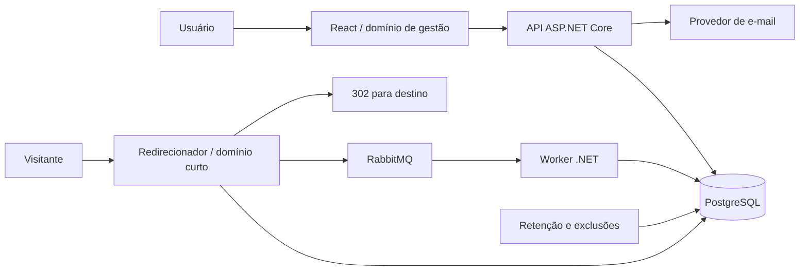

# Arquitetura compartilhada — Encurtador de URLs

Versão 1.0 • 5 de setembro de 2026

## 1. Arquitetura e fronteiras

React com TypeScript serve a interface; ASP.NET Core 10 sobre .NET 10 implementa API de gestão e redirecionador, executáveis independentes que compartilham bibliotecas de domínio. Um worker .NET consome RabbitMQ e persiste eventos e agregados em PostgreSQL. Um job .NET executa retenção e exclusões. A produção usa versões estáveis suportadas, fixadas no repositório e nas imagens durante a implementação.

O frontend e `/api/v1` usam a mesma origem por proxy reverso. O domínio curto serve exclusivamente o redirecionamento e endpoints operacionais inacessíveis pela rota pública de um segmento. Não reservar palavras alfanuméricas que possam colidir com códigos; health checks ficam em outra porta/rede.

Não introduzir Redis, cache de destino ou réplicas de leitura na primeira implementação. Resolver link e estado da conta no primário evita que cache torne bloqueios ineficazes. Abrir espaço para cache futuro somente com invalidação e testes de revogação. A interface estática pode usar CDN; respostas do redirecionador não podem ser armazenadas por CDN.

Configurações obrigatórias: origens de gestão, domínio curto e aliases, proxies confiáveis, conexão PostgreSQL, RabbitMQ, e-mail, chave JWT e identificador `kid`, emissor e audiência. Segredos ficam no gerenciador de segredos, nunca no bundle React.

Nomes físicos das filas principal e de quarentena são configurações versionadas, com `access.recorded.v1` como nome inicial da principal. Exchange `access`, routing key `recorded.v1` e schema do envelope permanecem estáveis durante troca de fila para saneamento.

## 2. IDs e Base62

Usar `BIGINT` de 64 bits com sinal e sequência global iniciando em 1, incremento 1, `NO CYCLE`. O mesmo ID identifica o link e gera seu código. Nunca obter ID por `MAX(id)+1`, reiniciar a sequência ou reciclar códigos. Falhas de transação podem deixar lacunas. A reserva externa de faixas descrita no plano de operação limita a emissão e impede reutilização após restore. [Semântica de sequências PostgreSQL](https://www.postgresql.org/docs/16/functions-sequence.html)

Alfabeto congelado: `0123456789abcdefghijklmnopqrstuvwxyzABCDEFGHIJKLMNOPQRSTUVWXYZ`. Converter por divisões inteiras sucessivas por 62, inverter os restos, sem zeros à esquerda. Decodificação é opcional; a resolução obrigatória usa o código textual armazenado. Todas as contas aritméticas usam inteiro de 64 bits com verificação de overflow; nunca `double` ou `Number` JavaScript.

| ID decimal | Código |
|---|---|
| 1 | `1` |
| 9 | `9` |
| 10 | `a` |
| 35 | `z` |
| 36 | `A` |
| 61 | `Z` |
| 62 | `10` |
| 3.843 | `ZZ` |
| 3.844 | `100` |

Seis posições têm `62^6 = 56.800.235.584` combinações; sete, `3.521.614.606.208`. Estes valores contam cadeias de comprimento fixo, não a quantidade restante da sequência. O maior `BIGINT` positivo, 9.223.372.036.854.775.807, exige 11 posições. Armazenar código em `varchar(11) COLLATE "C"`, com UNIQUE e validação ASCII. Serializar IDs e contagens de 64 bits na API como strings decimais para não perder precisão no React.

Comprimento fixo nunca oferece capacidade infinita. A decisão oferece capacidade prática muito grande, sem colisões geradas pela conversão, mas não elimina limites de armazenamento e vazão. ID público não substitui autorização. A diferenciação de caixa no caminho é compatível com [RFC 3986](https://www.rfc-editor.org/rfc/rfc3986.html).

## 3. Modelo persistente

Todos os instantes são `timestamptz`, tratados em UTC. Datas de agregação são datas UTC. Migrações EF Core gerenciam o esquema; SQL explícito implementa inserção idempotente e agregação em lote.

| Entidade | Campos essenciais e invariantes |
|---|---|
| users | UUID PK; email, normalized_email UNIQUE; password_hash via ASP.NET Core Identity; email_verified_at; role `user/admin`; blocked_at; deletion_requested_at; created_at. Normalização por trim e normalizador de e-mail Identity, sem regras específicas de provedores. |
| auth_sessions | UUID PK usado no claim sid; user_id FK; created_at; expires_at absoluto de 30 dias; revoked_at. Cada login abre uma família de refresh tokens. |
| refresh_tokens | UUID PK; session_id FK; token_hash UNIQUE; created_at; consumed_at; replaced_by; expires_at herdado da sessão. Guardar tokens consumidos até a expiração da família para detectar reutilização. |
| action_tokens | Hash UNIQUE; user_id; purpose `verify_email/reset_password`; expires_at; consumed_at. Tokens aleatórios, nunca texto puro. |
| links | BIGINT PK pela sequência; code UNIQUE sensível à caixa; owner_id UUID nullable; destination_url text nullable; created_at; owner_disabled_at; admin_blocked_at; deleted_at. Destino/owner só ficam nulos após exclusão; código/ID permanecem como reserva permanente. |
| access_events | occurred_at, event_id UUID, link_id BIGINT, source_ip inet; PK (occurred_at, event_id); particionamento RANGE diário por occurred_at. |
| daily_totals | link_id, day_utc, stripe de 0 a 15, count BIGINT não negativo, updated_at; PK (link_id, day_utc, stripe). API soma as 16 faixas internas. |
| admin_audit | UUID; actor_id nullable; target_type/id; action; reason; occurred_at. Retenção operacional de 1 ano; anonimização na exclusão de conta. |
| collection_incidents | UUID; started_at; ended_at nullable; kind; severity; confirmed_failure_count e unconfirmed_count quando observáveis. Sem IP ou URL; retenção de 1 ano. |
| creation_requests | owner_id + idempotency_key UNIQUE; hash da URL validada; link_id; expires_at de 24 horas. Criada na mesma transação do link. |
| deletion_jobs | ID, user_id temporário, status, requested_at, completed_at; marca de exclusão UUID sem e-mail conservada por 30 dias para reaplicação após restore. |

Índices: links(owner_id, created_at DESC, id DESC); eventos(link_id, occurred_at DESC, event_id DESC) em cada partição; sessions(user_id); totais pela PK; audit(occurred_at DESC, id DESC). Constraints impedem contagem negativa e estados de link sem destino enquanto ativo.

Não usar FK de bilhões de eventos para usuários. O worker verifica o link e a conta na transação; links reservados não são fisicamente removidos. Jobs de exclusão e inserções concorrentes seguem a coordenação descrita abaixo.

## 4. Autenticação e proteção

Gerenciar senhas com ASP.NET Core Identity e seus hashes versionados. Emitir JWT assinado RS256 com chave privada em secret manager, claims `sub`, `sid`, `jti`, `iss`, `aud`, `iat`, `nbf`, `exp` e papel. Validar algoritmo permitido, assinatura, emissor, audiência, validade e tolerância de relógio de até 30 segundos. Consultar conta e sessão no banco em cada chamada protegida para revogação imediata; conferir papel atual para administração. [Documentação de JWT Bearer](https://learn.microsoft.com/en-us/aspnet/core/security/authentication/configure-jwt-bearer-authentication)

JWT: 900 segundos, apenas memória React, nunca localStorage, URL ou cookie. Refresh token: 32 bytes criptograficamente aleatórios codificados para transporte; SHA-256 persistido. Cookie `__Secure-refresh`, host-only, Path `/api/v1/auth`, HttpOnly, Secure, SameSite=Strict, expiração absoluta igual à sessão. A restrição Base62 aplica-se somente ao código do link; JWT usa seu formato padrão com segmentos Base64url separados por pontos.

`GET /api/v1/auth/csrf` emite cookie antiforgery HttpOnly, Secure, SameSite=Strict, host-only, Path `/api/v1/auth`, e retorna request token. Frontend mantém o request token em memória e envia `X-CSRF-Token` em todos os POSTs de autenticação, incluindo login e logout. Usar antiforgery ASP.NET Core e rejeitar Origin ausente ou diferente da origem de gestão. Rotas `/auth` não autenticam por JWT nem tornam o refresh cookie uma identidade ASP.NET: emissão e validação antiforgery usam o mesmo contexto anônimo, evitando incompatibilidade após login. O cliente não envia Bearer nessas rotas. Corpos, quando exigidos pelo contrato, aceitam apenas JSON; refresh/logout não exigem corpo. Não liberar CORS para origens externas. A API de negócio exige Authorization Bearer e não usa refresh cookie como autenticação.

Rotação: bloquear linha da sessão em transação, validar token não consumido e sessão ativa; marcar token consumido, criar substituto e confirmar antes de responder com novo cookie. Reuso de token consumido revoga toda a sessão e retorna 401. O React serializa refresh entre abas com Web Locks e coordena atualização com BroadcastChannel; não repetir automaticamente um refresh cujo resultado se perdeu. Em resultado ambíguo, exigir novo login, evitando criar uma janela de tolerância insegura. Sessão não desliza além dos 30 dias iniciais.

Logout exige refresh cookie e CSRF, revoga a sessão e limpa cookie com os mesmos atributos; é idempotente mesmo para cookie expirado ou ausente. Reset de senha revoga todas as sessões. Bloqueio e exclusão têm o mesmo efeito global. Rotação de chave JWT publica chave nova antes de usá-la e conserva a anterior pelo TTL máximo mais tolerância.

Limites iniciais: login 10 tentativas por IP/10 min; envio de e-mail 3 por e-mail/h e 20 por IP/h; criação 60/min por usuário; demais rotas protegidas 300/min por usuário. Contadores compartilhados entre réplicas pelo gateway, com chave de usuário derivada somente de JWT validado, ou pela API/PostgreSQL quando essa integração não existir. 429 inclui Retry-After. Não filtrar acessos repetidos no redirecionador. Limites defensivos de infraestrutura devem ser monitorados separadamente e não anunciados como antifraude.

## 5. Contrato HTTP e URL

[openapi.json](contracts/openapi.json) é o contrato OpenAPI 3.1 complementar. A API usa JSON camelCase, UTC em RFC 3339 e Problem Details em `application/problem+json` com code e traceId. Não expor stack trace, SQL ou segredos. Respostas autenticadas e de autenticação incluem Cache-Control: no-store.

| Grupo | Operações |
|---|---|
| Auth | GET csrf; POST register, verify-email, resend-verification, login, refresh, logout, forgot-password, reset-password. |
| Conta | GET /me; POST /me/deletion. |
| Links | POST/GET /links; GET /links/{linkId}; POST /links/{linkId}/deactivate. |
| Relatórios | GET /links/{linkId}/stats e /links/{linkId}/events. |
| Admin | GET /admin/users, /admin/links, /admin/audit; POST block/unblock para conta e link. |
| Público | GET e HEAD /{code} no domínio curto. |

Página: `{items, nextCursor}`; cursor opaco assinado inclui versão, usuário, rota, filtros resolvidos, limite, última chave e vencimento de 24 horas, sem offsets. Vincular ao usuário atual, verificar autorização novamente e rejeitar cursor adulterado, vencido ou usado em outra rota com 400 `invalid_cursor`. Na continuação, filtros podem ser omitidos e são recuperados do cursor; se fornecidos, devem coincidir com a primeira página. Mudança de filtro ou limite invalida o cursor com 400. Listas ordenam por criação decrescente e ID decrescente; eventos por occurred_at e event_id. Um cursor não representa snapshot transacional: novos eventos no topo aparecem ao atualizar a primeira página.

Stats recebe from/to como datas, inclusivas, máximo 366 dias e dias futuros rejeitados; omissão de ambas usa últimos 30 dias. Retorna dias sem eventos com count `"0"`, total e collectionHealth. Events recebe limites RFC 3339 `[from,to)`, padrão janela de 90 dias até agora; na primeira página, limites fora da retenção retornam 400 com `retention_window`. Fornecer ambos os limites ou nenhum. Cursor conserva a janela inicial; em páginas seguintes, aplicar também o corte atual de retenção, omitindo eventos que venceram durante a navegação. Nunca retornar valores vencidos. Estatísticas agregadas são por UTC; não oferecer reagrupamento arbitrário de fuso.

Estado público do Link na API: `disabled` tem precedência se o proprietário desativou; caso contrário, `blocked` quando o link ou conta estiver bloqueado; nos demais casos, `active`. Conta em exclusão não pode usar a API e não aparece como link de usuário. Para AdminUser, precedência: `deleting`, `blocked`, `unverified`, `active`. Endpoints administrativos retornam 409 para alvo já em exclusão. Solicitações repetidas que não mudam estado retornam sucesso sem duplicar auditoria.

Criação exige Idempotency-Key UUID novo por ação do usuário; mesma chave e URL em 24 horas retornam mesmo link e 201, com o estado atual; outra URL retorna 409. Comparar SHA-256 dos bytes UTF-8 da URL após trim, sem normalização do destino. Usar bloqueio transacional da chave/registro único para chamadas concorrentes. Após 24 horas, a chave pode produzir outro link; remover ou substituir o registro vencido atomicamente, sem depender do horário do job de limpeza. Não repetir silenciosamente fora dessa janela.

Validar URL com parser absoluto, esquema case-insensitive HTTP/HTTPS, host presente, limite e proibições funcionais. Rejeitar caracteres de controle e barra invertida. Normalizar somente o host para comparação contra aliases (IDNA e remoção de ponto final); comparar independentemente de porta/esquema. Persistir e usar no Location a string original após trim, sem decode/reencode de caminho, query ou fragmento. Testar como o servidor escreve Location. Não realizar fetch, resolver DNS nem aplicar o destino como URL de chamada interna. Rejeição do próprio host não detecta ciclos indiretos entre serviços; não fazer crawler para isso.

## 6. Redirecionamento e captura

1. Aceitar um único segmento ASCII de 1 a 11 alfanuméricos. Consultar código exato; não converter caixa nem aceitar aliases por decodificação numérica. Query recebida no link curto é ignorada.
2. Resolver link e conta em uma consulta no primário. Ausente retorna 404; qualquer bloqueio, desativação ou exclusão retorna 410. Falha/timeout de leitura retorna 503 com Retry-After: 1. HEAD aplica as mesmas regras sem publicação.
3. Para GET disponível, capturar instante UTC no serviço e IP resolvido pelo middleware; gerar UUID v4 de evento. O envelope é imutável para qualquer retry.
4. Publicar `access.recorded.v1` no exchange durável `access`, routing key `recorded.v1`, fila quorum durável `access.recorded.v1`, mensagem persistente, mandatory e publisher confirms. Reutilizar conexões/canais com limites; não abrir conexão por GET.
5. Orçamento total da publicação, inclusive espera por capacidade do pool e confirmação: 100 ms por requisição. Confirmação permite prosseguir; nack, unroutable, falha ou timeout também permitem prosseguir, com telemetria. Não executar tarefas ilimitadas após responder; nenhum retry não durável é prometido. Timeout é resultado desconhecido, não prova de perda.
6. Retornar 302, Location original, Cache-Control: no-store e Referrer-Policy: no-referrer. Não incrementar contadores diretamente no redirecionador.

Evento JSON: `schemaVersion: 1`, `eventId` UUID, `linkId` string decimal, `occurredAt` RFC 3339 UTC com precisão de microssegundos, `sourceIp` string IPv4/IPv6. Nenhum e-mail, JWT, User-Agent, referrer ou destino no envelope. A precisão de occurredAt deve permanecer idêntica em reentregas e no banco.

Configurar Forwarded Headers antes da captura, lista explícita de redes/proxies e número esperado de saltos; proxy de borda substitui cabeçalhos recebidos do cliente. Sem proxy confiável, usar RemoteIpAddress. Normalizar IPv4 mapeado em IPv6 para IPv4. Não aceitar IP declarado em query ou corpo. Se não houver IP disponível, redirecionar e registrar falha de coleta, sem fabricar IP.

Alterações administrativas valem para resoluções iniciadas após commit; um GET já resolvido pode concluir. Não há atomicidade distribuída entre envio de evento e recebimento do 302 pelo cliente.

## 7. Consumo, idempotência e agregação

Configurar consumidores com ack manual, prefetch inicial 500 e lotes de até 500 eventos ou 100 ms. Essas escolhas são parâmetros de carga, não garantias de capacidade. Broker pode redeliver: confirmar ao broker somente depois do commit. [Guia de confiabilidade RabbitMQ](https://www.rabbitmq.com/docs/reliability)

Transação por lote: validar schema; bloquear usuários referidos em ordem de UUID com FOR SHARE, depois links em ordem de ID; descartar/ack eventos de contas em exclusão ou links já eliminados. Eventos de links apenas desativados/bloqueados podem ter sido recebidos antes do bloqueio e continuam elegíveis. Jobs de exclusão usam a mesma ordem de bloqueio para não permitir reinserção após limpeza.

Descartar sem agregar eventos com occurredAt anterior ao corte de 90 dias; isso também impede que replay antigo duplique totais depois do expurgo. Data mais de 5 minutos no futuro ou formato inválido vai para quarentena. Inserir com `ON CONFLICT (occurred_at,event_id) DO NOTHING RETURNING ...`. Somente linhas efetivamente inseridas alimentam o UPSERT dos totais, na mesma transação. Stripe = primeiro byte do UUID na representação hexadecimal canônica módulo 16. Agrupar por link/dia/stripe para evitar uma atualização por evento. Deduplicar chaves dentro do lote antes do INSERT.

A PK composta inclui a chave de partição, conforme a limitação de unicidade de tabelas particionadas. O contrato interno obriga retries a manter eventId e occurredAt juntos; alterar o timestamp cria outra identidade e é erro de produtor. Producers são serviços autenticados, não clientes públicos. [Particionamento PostgreSQL](https://www.postgresql.org/docs/current/ddl-partitioning.html)

Falha transitória no banco pausa consumo, com backoff exponencial de 1 a 30 segundos e reentrega; não descartar lote por esgotar tentativas durante indisponibilidade. Mensagem inválida vai para quarentena durável com confirmação antes do ack original. Reprocessar quarentena mantém envelope/identidade original. Quarentena expira em 7 dias, com alerta desde a primeira mensagem; eventos válidos aguardando no fluxo principal expiram ao atingir a retenção, sempre com registro de descarte observado.

## 8. Saúde dos relatórios, retenção e exclusão

collectionHealth contém `status: healthy|delayed|degraded|unknown`, observedAt nullable, oldestPendingAt nullable, lastPersistedEventAt nullable e intervalos de incidente. lastPersistedEventAt não é watermark: não prova que tudo anterior foi processado. Monitor independente amostra atraso a cada 15 segundos e persiste estado/incidentes. Precedência: snapshot ausente ou mais velho que 60 segundos resulta em unknown; incidente de falha de publicação ainda aberto em degraded; evento pendente há mais de 60 segundos em delayed; senão healthy. A idade inclui eventos entregues mas ainda sem ack, usando telemetria dos consumidores. Ausência de tráfego com fila vazia e monitores saudáveis não é atraso. Retornar incidentes que sobreponham o período consultado, mesmo depois de encerrados; status representa a saúde atual, não a completude histórica. Períodos anteriores à retenção de incidentes recebem aviso de histórico de coleta indisponível, sem declarar completude.

Criar partições diárias com 7 dias de antecedência. Job horário remove partições inteiramente anteriores a agora-90 dias e elimina em lotes o trecho vencido da partição de fronteira. Query aplica corte exato. Não usar partição default silenciosa. Falta de partição dispara alerta e retry sem ack. Operações de detach/drop seguem procedimento com controle de locks. [Documentação PostgreSQL](https://www.postgresql.org/docs/current/ddl-partitioning.html)

Exclusão: validar senha e confirmação; persistir primeiro marcador externo idempotente com userId, jobId e requestedAt, fora do PITR principal. Somente depois, em transação, marcar conta como em exclusão, revogar sessões e criar job; retornar 202 após commit. Se o armazenamento externo falhar, retornar 503 sem aceitar a solicitação. Se o marcador existir mas a transação falhar, reconciliador executa a exclusão em até 24 horas a partir de requestedAt; novas tentativas usam o mesmo marcador. Essa operação externa é uma decisão durável de exclusão, não é desfeita em falha de resposta. Resolução pública passa a 410 após a marcação local; worker não aceita novos eventos para essa conta.

Job apaga eventos e agregados dos links em lotes, elimina dados de autenticação e chaves idempotentes, remove destino/owner dos links e conserva somente reserva do código, ID e marcador de exclusão. Anonimizar referências e conteúdo pessoal em auditoria. Finalizar removendo a conta. Reexecutar job deve ser seguro após falha. O prazo de 24 horas inclui remoção dos envelopes com IP em fila e quarentena: drenar por consumidor que descarta eventos para conta em exclusão ou link tombstonado; se necessário usar saneamento coordenado com republicação confirmada dos demais envelopes, conforme o runbook operacional. Mensagem malformada sem linkId confiável não permite atribuir titular e deve ser descartada conservadoramente nesse saneamento, registrando incidente sem conteúdo pessoal. Não concluir job antes dessas verificações.

TTL de token, log, quarentena e backup deve ser aplicado também fora do PostgreSQL. URLs, IPs e tokens não entram em logs genéricos ou rótulos de métricas. O plano de operação define limpeza e restauração.

## 9. Decisões para evolução

Separar armazenamento de eventos do banco transacional quando medições mostrarem competição de I/O; preservar contrato de evento e idempotência. Adicionar cache somente após especificar invalidação de links/contas. Distribuir geração por blocos não sobrepostos se a sequência se tornar gargalo comprovado. Nenhuma dessas evoluções é requisito inicial. Pagamentos futuros exigem um novo contrato de elegibilidade, antifraude e contabilização, pois esta versão aceita perda de eventos.

## Organização da implementação

As funcionalidades em [features](README.md) referenciam estas regras técnicas em vez de copiá-las. Testes e recuperação ficam em [operations.md](operations.md); contratos em [OpenAPI](contracts/openapi.json).
